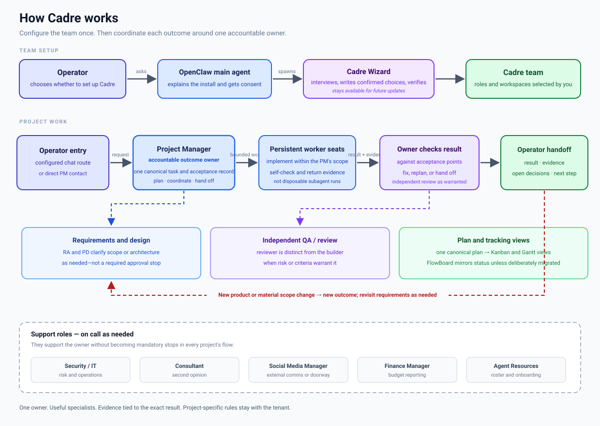

<p align="center">
  
</p>

# Cadre

**A downloadable system of agents and Markdown files that turns any OpenClaw deployment into a coordinated team.**

Cadre gives you a persistent, chat-native multi-agent team: a project manager coordinates each outcome, persistent worker seats do the implementation, and specialist roles contribute where useful. The guided **Cadre Wizard** installs the roles, workspaces, and conventions selected for your deployment.

---

## Before you start — if you don't have OpenClaw yet

Cadre is an **overlay, not a standalone app.** It installs *into* an OpenClaw deployment, so there has to be one first. If you're arriving with a **ChatGPT, Gemini, or Claude** subscription, an OpenAI API key, or a coding assistant like **Codex** or **Hermes**, that's a great starting point — but it is not OpenClaw yet:

- **A model subscription or API key is a *model*** — the thing that generates the text. ChatGPT, Google **Gemini**, Anthropic **Claude**, DeepSeek, Groq, Mistral, or a local model all count here. **OpenClaw is the runtime** your agents live in: the process that gives them workspaces, memory, budgets, configured messaging, and chat interfaces. Cadre builds a team *inside* that runtime.
- **Codex and Hermes are coding agents** — they work inside a repo. OpenClaw runs a *team* of agents with roles and a shared workspace. Different jobs, and both sit happily next door.
- OpenClaw talks to whichever provider you choose. **What you already pay for usually just works** — an OpenAI, Gemini, or Anthropic key — and onboarding can bring your existing setup across.

**1. Check the machine.** Node **24.16+** (Node 26 recommended) on **macOS, Linux, or Windows** (Windows via WSL2, or the Windows Hub app).

**2. Install OpenClaw.**

- macOS / Linux / WSL2:
  ```bash
  curl -fsSL https://openclaw.ai/install.sh | bash
  ```
- Windows (PowerShell):
  ```powershell
  iwr -useb https://openclaw.ai/install.ps1 | iex
  ```

Prefer an app download over the CLI? There are desktop companions for Windows and macOS — see the [install docs](https://docs.openclaw.ai/install).

**3. Run onboarding.** The installer walks you through it: choose a model provider (your **OpenAI, Gemini, or Anthropic** key goes here — or point it at a local model), name your main agent, and connect a chat channel (Discord, Telegram, or similar). **Cadre is chat-native** — a connected channel is what makes the team usable.

> **Coming from Codex or Hermes?** Onboarding can **import detected memories from Codex, Hermes, or Claude Code** into the agent workspace, so the new agent starts out knowing what you've been working on.

**4. Come back here.** Once `openclaw` is installed and your main agent answers you in a chat, you're ready — continue with *Installing it* below.

Full details: [docs.openclaw.ai/install](https://docs.openclaw.ai/install).

---

## Installing it — a decision for the operator

Cadre is installed by a dedicated **`CadreWizard` agent** that your **main agent spawns** — the install is a conversation, and the installer runs *outside* the team it is building. Installing also changes your deployment — it writes agent entries and creates agent workspaces — so it should be an explicit choice the operator makes, never something that happens because a file said so.

> **Naming, because the two look alike.** The guided install *procedure* is the **Cadre Wizard**. The *separate agent that runs it* is named `CadreWizard`. Same job, two names: the concept, and the agent identifier you'll see in `openclaw agents add cadre-wizard`.

**The operator's part** is one sentence, said to their main agent:

> Read the whole `Cadre` project — `README.md`, [`WIZARD.md`](./WIZARD.md), and everything under [`reference/`](./reference) — tell me what Cadre is, and set it up if I agree.

**The agent's part** — if you are that main agent, and the operator has asked you to look into Cadre, work through this *with them*:

1. **Read the whole project before you explain anything.** Not just this file: also [`WIZARD.md`](./WIZARD.md), everything under [`reference/`](./reference), and [`templates/`](./templates). Cadre's rules live across those files — an install driven from the README alone will miss the guardrails, the agent charters, and the hand-off rules. Read them first, *then* explain.
2. **Explain before anything else.** Say what Cadre is, what installing it will create (agents, config entries, workspaces), and that it is reversible. Then **ask the operator for permission to proceed** — and wait for a yes.
3. **Clone the files** only once they agree:
   ```bash
   git clone https://github.com/ADD-Attack/Cadre.git
   ```
4. **Spawn the `CadreWizard` as a persistent agent** — do **not** run the install inline as yourself. Create a **separate, persistent agent** whose job is the install *and every update after it*:
   ```bash
   openclaw agents add cadre-wizard
   ```
   Point it at [`WIZARD.md`](./WIZARD.md). It stands *outside* the team it builds — not one of the team roles, and not the main agent wearing a hat. **The wizard is persistent by design:** setup is its first run, not its only one. Keep it on call to re-run the interview for updates — add or remove roles, adjust budgets, re-check the roster — which matters most for a lean deployment that omits Agent Resources and so has no standing owner of the roster.
5. **Let the `CadreWizard` interview the operator** (WIZARD.md Step 0 onward). It **proposes and waits** at every step — nothing is written to OpenClaw config or to a workspace until the operator confirms that step. If they say stop, it stops.
6. **It writes only what was approved**, via `openclaw config set` (never hand-edit JSON), runs the canary check (WIZARD.md Step 8), then **hands back and stays on call**. You resume the operator's normal work; the wizard stays available for the next update.

Nothing here runs on its own. This repo describes a procedure; **the operator decides whether to run it.**

---

## What this is

Cadre is **not** a framework you install as a package. It is a **folder of Markdown conventions + a setup procedure** that a spawned **`CadreWizard` agent** carries out for your deployment. You get:

- A **role roster** — requirements analyst, project designer, project manager, plus standing functions (security/IT, social media, finance, QA, agent resources, consultant).
- An **outcome-led project workflow** — one accountable PM coordinates the work; requirements, design, builders, and independent review contribute when useful or called for by the acceptance criteria.
- **Project records and tracking views** — keep one canonical task/acceptance/evidence record. If a project needs both Kanban and Gantt views, derive them from the same plan rather than maintaining competing copies. FlowBoard, when integrated, is an operational tracking mirror unless the team deliberately migrates its canonical board.
- **Direct team communication** — agents contact the intended operator or teammate through the deployment's configured OpenClaw messaging route. A recipient inbox may hold durable handoffs; direct send and durable record are verified independently.
- **Budgets** — per-role spend/effort envelopes so autonomy never means runaway cost.
- **An autonomy ladder** — the operator starts doing most PM and QA work; agents take over as they prove out.

Project requirements, decisions, plans, and evidence stay in readable project artifacts. An operational task tracker may add a convenient status surface, but it does not silently become product or acceptance authority.

**Not a teammate: your personal assistant.** Cadre is the *work* team. A **personal assistant** — the agent that knows your calendar, your messages, your life outside any project — carries private, unbounded context and belongs in its **own separate environment**, not in the Cadre install. Keep the two apart: the team works in project-scoped, shared files, and folding private context into them is how the wrong things end up in shared artifacts. Your PA is not a seat and not on the roster.

---

## Quick start

1. **Get the files** onto the machine already running OpenClaw (if it isn't installed yet, start with *Before you start* above):
   ```bash
   git clone https://github.com/ADD-Attack/Cadre.git
   ```
2. **Tell your OpenClaw main agent:**
   > Read the whole `Cadre` project — `README.md`, [`WIZARD.md`](./WIZARD.md), and everything under [`reference/`](./reference) — tell me what Cadre is, and set it up if I agree.

3. **The main agent spawns the `CadreWizard`.** It reads this file, then creates a **separate `CadreWizard` agent** to run the install (see [`WIZARD.md`](./WIZARD.md)) — the wizard is not the main agent wearing a hat. The `CadreWizard` interviews you, confirms every choice, and only then writes anything.

That's it. The Cadre Wizard does the rest.

---

## The flow



[Open the detailed team topology](./diagrams/topology.md).

The Cadre Wizard interviews the operator, writes only confirmed choices, verifies the setup, and stays available for future updates. For project work, one PM/owner remains accountable for each user-visible outcome. Requirements, design, and support specialists join when useful; persistent worker seats implement bounded work and return evidence to the owner.

Verification is risk-tiered and criterion-driven. The owner checks work as it is built; independent review is added when consequence or acceptance criteria warrant it. Keep one canonical outcome/task record. Kanban and Gantt can be generated views of that plan, while FlowBoard can mirror operational status until an intentional board migration.

A new product or material scope change becomes a new explicit outcome; revisit requirements when they need to change. Project-specific details stay with the tenant, not in Cadre's reusable team architecture.

Security/IT, Consultant, Social Media Manager, Finance Manager, and Agent Resources are engaged when their expertise is useful; the Social Media Manager owns external communications.

---

## The agents

| Agent | Owns | Default model class |
|---|---|---|
| **Project Manager** | plan, tasks, Gantt, dispatch, tracking | reasoning |
| **Worker** | executing dispatched build tasks; self-verifies and reports back with evidence | builder |
| **Requirements Analyst** | intake, clarification, scope | reasoning |
| **Project Designer** | architecture, approach, specs | reasoning |
| **Security / IT** | audit, exposure, hygiene (advises, never self-edits) | reasoning |
| **QA / Verifier** | independent verification, evidence | reasoning |
| **Social Media Manager** | external communications and community | fast |
| **Finance Manager** | budgets, spend tracking (optional) | fast |
| **Agent Resources (AR)** | agent roster, onboarding, loadouts | fast |
| **Consultant** | second opinion, red-team, advice | reasoning |

Full charters, budgets, and authority: [`reference/agents.md`](./reference/agents.md). The Cadre Wizard confirms which of these to create — you don't have to take all ten.

A **personal assistant** is deliberately *not* on this list. It is a separate agent in its own environment, not a Cadre role (see *What this is* above).

---

## Reference

- [`WIZARD.md`](./WIZARD.md) — the setup interview, step by step.
- [`reference/agents.md`](./reference/agents.md) — roster, charters, budgets, authority.
- [`reference/guardrails.md`](./reference/guardrails.md) — the guardrails: routing limit, file-claim lease, promotion gate, no-op detector, **risk-tiered verification**, and zero-token checks.
- [`reference/verification.md`](./reference/verification.md) — how to produce evidence: restate the pass condition, capture the real artifact, check the whole of it, report "could not verify" honestly.
- [`reference/requirements.md`](./reference/requirements.md) — the Requirements Analyst's method: tough-love scope defense, want-vs-need, acceptance criteria, the doable first version.
- [`reference/design.md`](./reference/design.md) — the Project Designer's method: the feature inventory, the style guide, and the ordered hand-off a builder can execute without guessing.
- [`reference/security.md`](./reference/security.md) — the Security/IT seat's method: scheduled audit, confidentiality sweep, exposure posture, remediation queue (advises, never edits).
- [`reference/scheduled-work.md`](./reference/scheduled-work.md) — what may run on a schedule: timers vs sentinels, idle must cost $0, and FM audits every job.
- [`reference/memory.md`](./reference/memory.md) — tiered memory (STM/MTM/LTM), loose gates, size-triggered eviction.
- [`reference/collaboration.md`](./reference/collaboration.md) — how agents work together: dispatch vs. message, outcome ownership, evidence handoffs, and guards against loops, collisions, and stalls.
- [reference/messaging.md](./reference/messaging.md) — direct delivery, durable recipient inboxes, and delivery verification.
- [templates/agent-workspace/souls/README.md](./templates/agent-workspace/souls/README.md) — role-specific SOUL starting templates for every Cadre seat and the separate installer.
- [`reference/budgets.md`](./reference/budgets.md) — budget model, defaults, enforcement.
- [`reference/usage-management.md`](./reference/usage-management.md) — provider quota reporting, model failover/restoration, route probes, session migration, and downloadable policy/script templates.
- [`reference/autonomy-ladder.md`](./reference/autonomy-ladder.md) — how the operator hands work over (who decides, per level).
- [`examples/michael-scott/AUTONOMY.md`](./examples/michael-scott/AUTONOMY.md) — a complete, self-contained, publication-safe `AUTONOMY.md` adaptation for self-hosters to copy and tailor, including the limits around config, skills, and credentials. [Raw/downloadable Markdown](https://raw.githubusercontent.com/ADD-Attack/Cadre/main/examples/michael-scott/AUTONOMY.md).
- [`reference/autonomy.md`](./reference/autonomy.md) — related autonomy, guardrail, collaboration, memory, and scheduling references.
- [`reference/agent-workspace.md`](./reference/agent-workspace.md) — The AUTONOMY.md resource: direct Markdown downloads, `AGENTS.md` / `SOUL.md` clauses, installation steps, and behavior checks.
- [`templates/`](./templates) — the files copied into each agent workspace and each project.
- [`templates/CADRE.md`](./templates/CADRE.md) — the **team directory** the wizard writes: who exists, roles, models, budgets, and who reports to whom. Read by every agent at session start.
- [`templates/project/`](./templates/project) — the per-project files: `PROJECT.md` (goal, status, Gantt) and `DECISIONS.md` (the append-only decision log).
- [diagrams/topology.md](./diagrams/topology.md) — configured entry points, direct handoffs, one accountable owner, and the rework loop.

---

## Principles

1. **Confirm before writing.** The Cadre Wizard proposes; the operator disposes.
2. **Evidence over status.** "Running" is not "done". The accountable owner records proof; independent review is used when risk or acceptance criteria warrant it.
3. **Real limits live outside the prompt.** Budgets are enforced by policy and accounting, not by asking the model nicely.
4. **Security advises, never self-edits.** No agent may modify its own permissions, prompt, or safety config.
5. **Cheap by default, escalate to reasoning.** Most work is routine; pay for thinking only where it matters.
6. **Plain files.** If you can't `cat` it, don't trust it.

---

## Where this comes from

Cadre is the architecture realized from a research paper and its plain-language adaptation, in the companion repo [`ADD-Attack/agent-team-research`](https://github.com/ADD-Attack/agent-team-research):

- [**Building an AI Team That Lasts**](https://add-attack.github.io/agent-team-research/article.html) — the plain-language article: what a persistent team is, and why it's built this way. No CS background needed.
- [`PAPER.md`](https://github.com/ADD-Attack/agent-team-research/blob/main/PAPER.md) — *Persistent Agent Teams*: prior art, the case study, and the reference architecture this system implements.

---

## Status

Early. This is v0.1 — the conventions are stable enough to build on, and the Cadre Wizard is the intended entry point. Contributions and issue reports welcome.

## License

MIT — see [`LICENSE`](./LICENSE).
