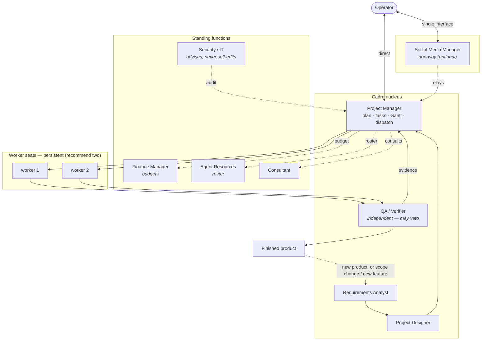

# Cadre — team topology

**Reading it:** projects enter at Requirements → Design → Plan. The PM owns execution and dispatches its **worker seats** — **the workers sit in the PM's scope**, and they are **persistent agents** (own workspace, memory, identity), not throwaway runs. **Cadre recommends two:** one is a single point of failure, and two lets the PM run in parallel. QA verifies independently (a *different* agent than the builder) and can block a "done" claim; passing verification produces the **finished product**. Once something ships, two things send work back to the start: a **scope change or new feature** to what just shipped, or a **new product** entirely — either way it re-enters at the Requirements Analyst rather than being patched mid-stream. The standing functions support the PM without doing project work: they ride *beside* the line, never on it. Security audits and advises but never edits config. The Social Media Manager is optional — it exists as the **doorway** for operators who want one interface.
