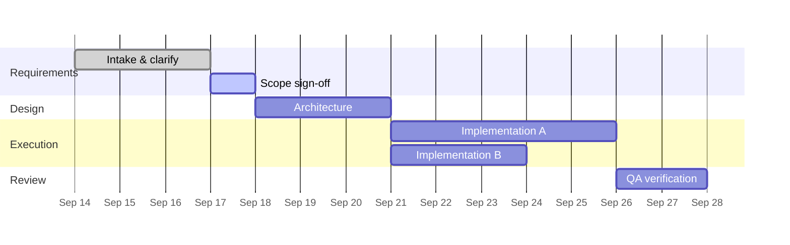

# PROJECT.md — <project name>

> The project's single source of truth. Created by the Project Manager after
> Requirements Analyst + Project Designer have handed off.
> Flow: **Requirements Analyst → Project Designer → Project Manager**.

## Goal

<One paragraph: what "done" means for this project.>

## Status

| Field | Value |
|---|---|
| Owner (PM) | <agent> |
| Phase | <requirements \| design \| planning \| execution \| review \| done> |
| Started | <date> |
| Target | <date> |
| Board | <FlowBoard project name, if used> |

## Requirements (from RA)

<Acceptance criteria. Each item is checkable — a statement someone can verify true/false.>

- [ ] REQ-1: …
- [ ] REQ-2: …

## Design (from PD)

<Approach, architecture, key decisions. Link `DECISIONS.md` entries.>

## Milestones

- [ ] M1 — <milestone>
- [ ] M2 — <milestone>
- [ ] M3 — <milestone>

## Gantt

Maintained by the PM. Rendered natively by GitHub from this Mermaid block.

**Maintenance rule:** the PM updates the Gantt whenever a task changes state. A stale chart is worse than no chart — it lies with authority.

## Tasks

Task *state* lives on the board (FlowBoard, or the task list below if no board is installed). This table is the PM's rollup.

| ID | Task | Owner | State | Depends on |
|---|---|---|---|---|
| T-1 | … | <agent> | backlog \| open \| in-progress \| review \| done | — |

## Risks & blockers

| Risk | Impact | Owner | Mitigation |
|---|---|---|---|

## Log

- <date> — <what changed>
